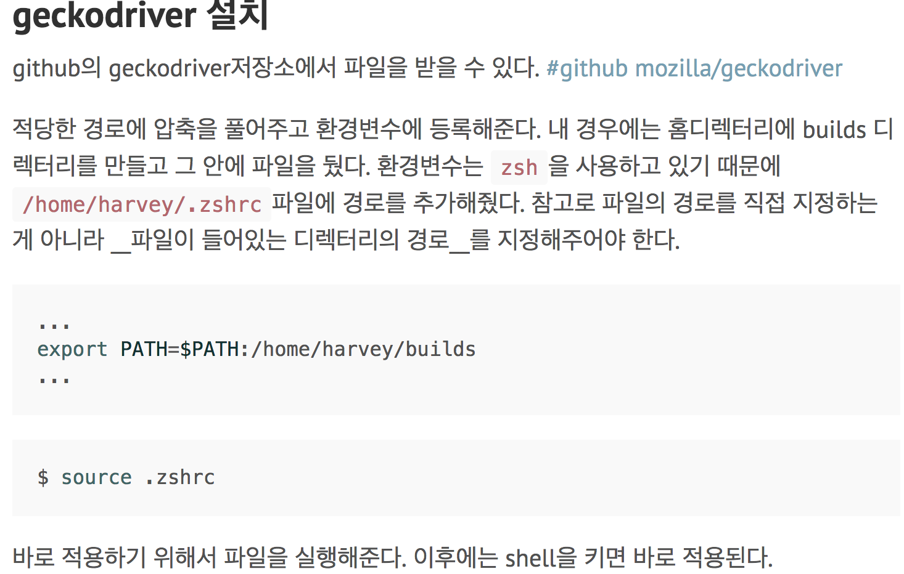
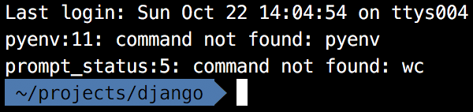
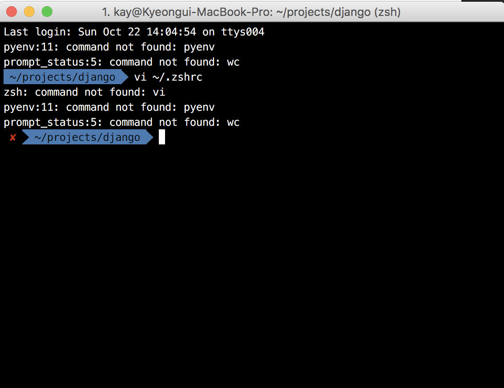
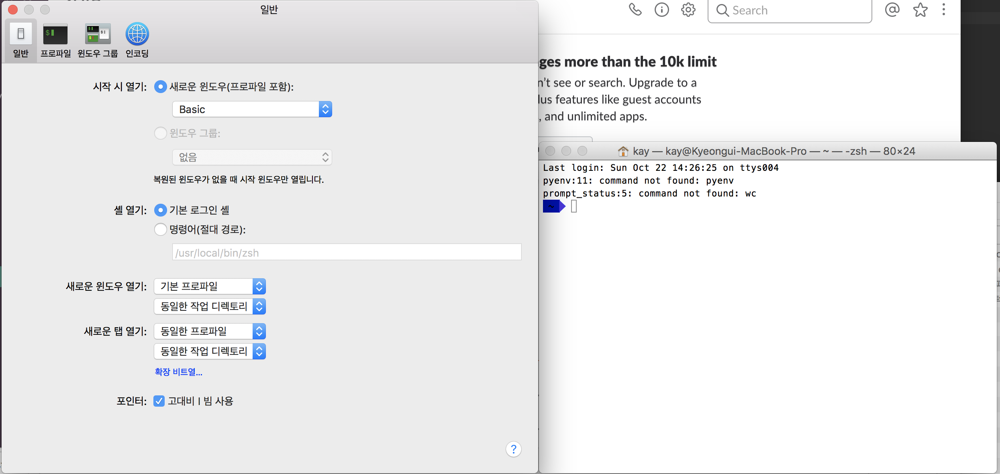

## .zshrc에 오타를 냈을 때 수정 방법

geckodriver를 설치하기 위해 위의 그림을 따라하다가 오타가 났는지 오류가 났다.

terminal창을 껐다가 다시 켜도 오류 메세지로 시작해서
어떠한 단어를 입력해도 오류 메세지만 보였다.

오타를 지우려고 시도했으나 되지 않았다.

terminal로 접속했다.

에서 셸 열기에서 절대 경로를 선택하고 `/bin/bash`만 입력한 후 창을 닫았다가 열었더니 오류 메세지가 나오지 않았다.

다시 `vi ~/.zshrc`로 접속하여 잘못 입력했던 내용을 삭제할 수 있었다.